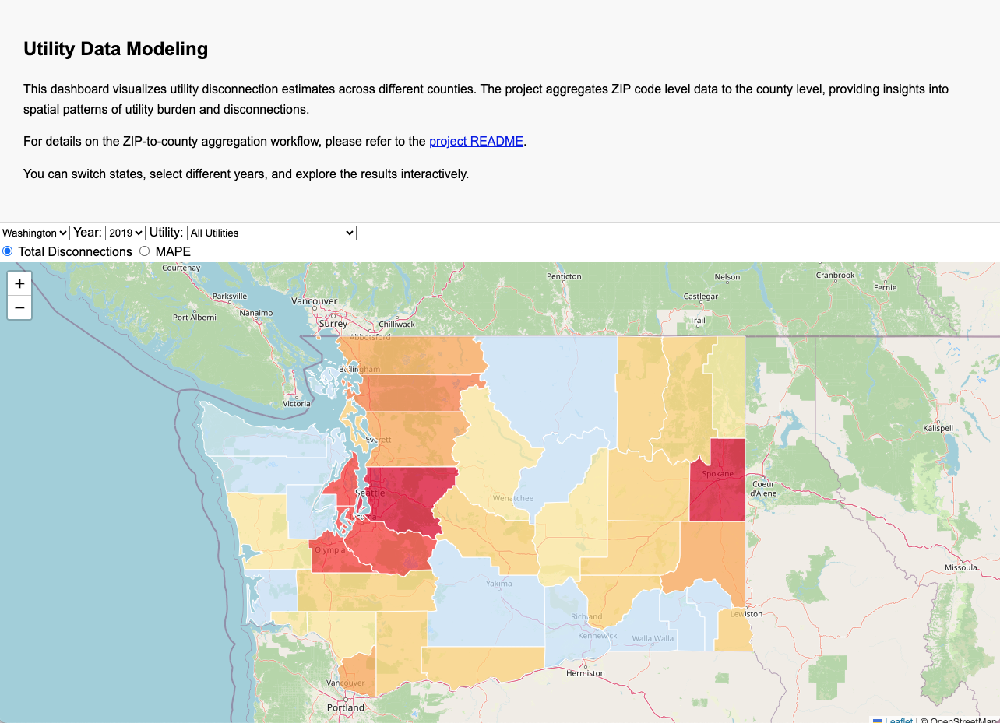
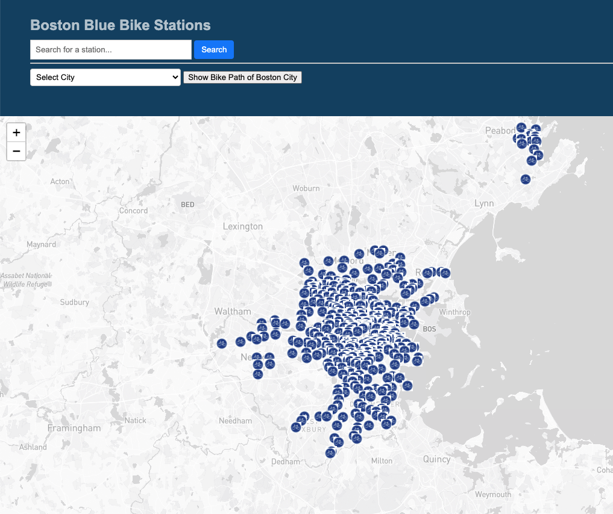

# Hi, I'm Jiatong Su 👋

## Table of Contents

   
Contents

1. [layout: default
title: "Welcome"](#layout-default-title-welcome)
1. [Featured Projects](#featured-projects)
1. [More Projects](#more-projects)

Hello! I'm Jiatong Su, a passionate researcher and data analyst specializing in transportation planning, geospatial analysis, and data visualization. With a strong background in R, Python, GIS, and machine learning.

[📄 View Resume](/resume/resume.md) | [📬 Email Me](mailto:sujiatong23@gmail.com)

## Featured Projects

  <h3>US Utility Disconnection Dashboard</h3>
    
  
Aggregated ZIP-level data to county level using HUD crosswalk, achieving MAPE < 2%. Built interactive Leaflet dashboard for multi-state analysis.

  
<strong>Tools:</strong> R, GeoPandas, Leaflet, JavaScript

  <a href="https://sujiatong.github.io/MUSA-Praticum-Jiatong/dashboard/index.html">🌐 View </a> |
  <a href="https://github.com/sujiatong/MUSA-Praticum-Jiatong">💻 Code</a>

---

  <h3>Boston Blue Bikes Dashboard</h3>
    
  

  Developed an interactive map of Boston Blue Bike stations with search and filter features. Includes station-level data visualization.
  

  
<strong>Tools:</strong> JavaScript, Leaflet, GeoJSON

  <a href="https://sujiatong.github.io/Boston_bike_dashboard/boston_bike/index.html">🌐 View</a> |
  <a href="https://github.com/sujiatong/Boston_bike_dashboard/tree/main">💻 Code</a>

---

  <h3>NJ Transit Delay Prediction</h3>
    
  
Built regression models to forecast metro train delays. Analyzed NJ Transit operational data and weather factors.

  
<strong>Tools:</strong> R, Regression, Data Cleaning

  <a href="https://sujiatong.github.io/Forecast_Metro_train_delays/ppa_final.html">🌐 View</a> |
  <a href="https://github.com/sujiatong/Forecast_Metro_train_delays">💻 Code</a>

---

## More Projects

- [Historical world boundaries](https://sujiatong.github.io/engagement_project/frontend/index.html)
- [LLMs for Sentiment Analyzing and image reasoning](https://github.com/sujiatong/Final-project-MUSA-6950)
- [Story Map of Metro between LA and DC](https://sujiatong.github.io/story_map_project/jiatong%20su/)
- [Predicting Housing Prices in Philadelphia](https://sujiatong.github.io/ppa_upenn/ppa_final/PPA_midterm_Group%20Tong%20(2).html)
- [Bike Share Prediction](https://sujiatong.github.io/ppa_upenn/hw5b/Su_Jiatong_HW5b.html)
- [Geospatial Risk Prediction](https://sujiatong.github.io/ppa_upenn/HW3/Su_JiatongHW3.html)
- [30-Day Map Challenge (10 maps completed)](https://sujiatong.github.io/30DayMap-Jiatong/)
- [Hurricane Impact with Water Quality and Land Cover Change](images/Final_GEOG115C_S23_Poster_Mathlouthi-Nava-Su.pdf)